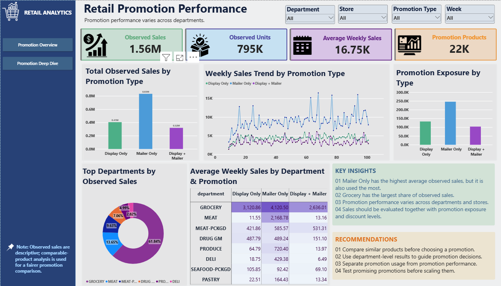
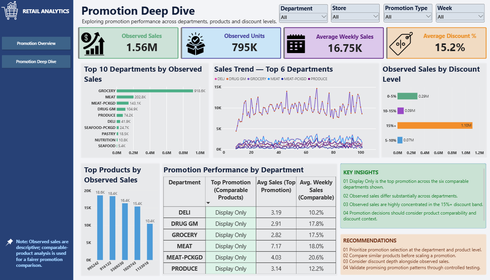

# Retail Promotion Performance Analysis

**Portfolio project | SQL · Python · PostgreSQL · Power BI · DAX**

## Project status

The two-page Power BI dashboard is built and the `Observed Sales` and `Observed Units` measures reconcile with SQL when both use the same `promotion_type <> 'Unknown'` filter. A broader promotion-coverage reconciliation remains open, so the findings should not yet be presented as final business conclusions.

## Business problem

Retail teams need to understand how observed product sales differ across promotion-support patterns, departments, stores, and discount levels. Comparing raw totals alone can be misleading when products have unequal exposure to each promotion type.

## Objective

Build a repeatable analytical workflow that combines transaction data, product attributes, and weekly promotion-support information, then presents comparable sales patterns in a Power BI dashboard. The analysis is descriptive: it identifies associations in observed data and does **not** establish that a promotion caused a sales increase.

## Dataset

This project uses **dunnhumby — The Complete Journey** dataset. The public source describes household-level transactions over approximately two years for a group of 2,500 frequent-shopping households, along with product and marketing information. The source files include transaction data, product metadata, and weekly promotion-support fields such as `display` and `mailer`.

- Official dataset portal: <https://www.dunnhumby.com/source-files/>
- Download the source data yourself; large raw CSV files should not be committed to GitHub.

## Tools

- **Python:** ETL checks and PostgreSQL loading
- **PostgreSQL:** raw storage, aggregation, joins, and analytical view
- **SQL:** weekly sales aggregation and promotion classification
- **Power BI:** interactive two-page dashboard
- **DAX:** KPI measures and promotion-comparison calculations

## Workflow

```text
Source CSV files
      ↓
Python ETL: validate inputs and load CSVs into PostgreSQL
      ↓
PostgreSQL raw tables
  ├── retail.transactions
  ├── retail.products
  └── retail.causal_raw
      ↓
SQL transformations
  ├── retail.weekly_sales        (product × store × week sales metrics)
  ├── retail.promotion_support   (product × store × week promotion flags)
  └── retail.promotion_analysis  (combined analysis view)
      ↓
Power BI model and DAX measures
      ↓
Promotion Overview + Promotion Deep Dive
```

The current ETL supports a full raw-table load using `--load`. The SQL transformation step should be kept as version-controlled `.sql` files and run after loading; do not describe the current project as a fully automated one-command end-to-end pipeline unless that has been implemented and tested.

## Data model and key logic

### Weekly sales

Sales transactions are aggregated to **product–store–week** grain with the following measures:

- `sales`: sum of `sales_value`
- `units`: sum of `quantity`
- `transactions`: distinct basket count
- `retail_discount`: sum of retail discount
- `coupon_discount`: sum of coupon discount

### Promotion support

The causal/promotion source is grouped by product, store, and week. A display or mailer flag is set when any record for that key indicates the relevant support. Multiple support records for the same key are collapsed into one set of flags.

### Promotion classification

The analysis view classifies records as `Display Only`, `Mailer Only`, `Display + Mailer`, `Neither`, or `Unknown` when no promotion-support key matches. KPI measures that exclude `Unknown` describe **classified observations**, not all sales in the raw transaction history.

## Business questions

1. How do observed sales differ among Display Only, Mailer Only, and Display + Mailer?
2. How do observed sales vary by department and store?
3. How does the weekly sales pattern differ across promotion types?
4. How concentrated are observed sales across discount bands?
5. When comparing promotion types, which products have sufficient observations across types to support a fairer comparison?

## Dashboard

### Page 1 — Promotion Overview

Provides high-level KPIs, observed sales by promotion type, weekly trend, department performance, and promotion exposure. Slicers allow users to explore department, store, promotion type, and week.



### Page 2 — Promotion Deep Dive

Explores department and product performance, observed sales trends, discount levels, and a comparable-product promotion matrix. Results should be interpreted using the filters and comparison rules displayed in the report.



## KPI definitions

- **Observed Sales:** sum of `sales` for rows where `promotion_type` is not `Unknown`.
- **Observed Units:** sum of `units` for rows where `promotion_type` is not `Unknown`.
- **Average Weekly Sales:** use the exact DAX definition in the report model; document the denominator and filter context before publishing a final result.
- **Average Discount %:** derived from the discount fields and sales; interpret this measure only after confirming the source sign convention and the exact formula in the Power BI model.

## Validation Status and Business Findings

### KPI validation

The following Power BI KPI measures have been reconciled against PostgreSQL using the same `promotion_type <> 'Unknown'` filter.

| Metric | SQL result | Power BI display | Status |
|---|---:|---:|---|
| Observed Sales | 1,557,750.83 | 1.56M | Matches after rounding |
| Observed Units | 794,593 | 795K | Matches after rounding |

### Business Question 1 — Observed sales by promotion type

The analysis uses product-store-week observations. The counts below are observations, not distinct weeks.

| Promotion type | Observations | Average sales per observation | Average units per observation |
|---|---:|---:|---:|
| Mailer Only | 246,268 | 3.38 | 1.67 |
| Display + Mailer | 103,920 | 3.07 | 1.75 |
| Display Only | 133,132 | 3.04 | 1.50 |

Mailer Only has the highest average sales per observation in this overall classified-data comparison. This is an observed association, not proof of causal promotion lift.

### Business Question 2 — Comparable-product comparison

Products must have at least two distinct weeks under each of the three promotion types. Each product receives equal weight in the final average.

| Promotion type | Comparable products | Average product-level sales |
|---|---:|---:|
| Display Only | 2,915 | 3.080 |
| Mailer Only | 2,915 | 2.923 |
| Display + Mailer | 2,915 | 2.914 |

Display Only has the highest average product-level sales in this comparable-product analysis. This result does not establish that Display Only caused higher sales.

### Business Question 3 — Department-level product winners

For each comparable product, the promotion type with the highest observed average sales is counted as the winner. Ties are reported separately. Only departments with at least 30 comparable products are included.

| Department | Comparable products | Display Only highest (%) | Mailer Only highest (%) | Display + Mailer highest (%) | Ties (%) |
|---|---:|---:|---:|---:|---:|
| GROCERY | 2,172 | 44.43 | 27.26 | 27.72 | 0.60 |
| MEAT-PCKGD | 293 | 48.12 | 25.60 | 25.94 | 0.34 |
| DRUG GM | 282 | 38.30 | 30.50 | 26.24 | 4.96 |
| SEAFOOD-PCKGD | 61 | 52.46 | 21.31 | 26.23 | 0.00 |
| NUTRITION | 33 | 51.52 | 42.42 | 6.06 | 0.00 |

Percentages can differ slightly from 100% because of rounding.

### Business Question 5 — Store-level comparison

Among 113 comparable stores with at least two distinct weeks for each promotion type, the promotion with the highest observed average sales was:

| Promotion type | Stores where it ranked highest |
|---|---:|
| Display Only | 22 |
| Mailer Only | 82 |
| Display + Mailer | 9 |
| Highest-sales ties | 0 |
| Total comparable stores | 113 |

Mailer Only ranked highest in the largest number of comparable stores. This is a descriptive result and does not establish causal effectiveness.

### Data coverage limitation

The analysis contains 2,370,784 product-store-week observations in total.

| Category | Observations | Sales | Units |
|---|---:|---:|---:|
| Unknown promotion type | 1,887,464 | 6,499,712.25 | 259,891,029 |
| Classified promotion types | 483,320 | 1,557,750.83 | 794,593 |
| Total | 2,370,784 | 8,057,463.08 | 260,685,622 |

Unknown records account for approximately 79.6% of observations, 80.7% of sales, and 99.7% of units. A record is classified as Unknown when its product-store-week key does not match the promotion-support data.

The unmatched records include both products absent from the promotion-support table and products whose store-week key does not match. Some products, including gasoline-related items, also contain unusually large quantity values. These values have not been assumed to be errors or converted to another unit without confirmation of the source-data encoding.

Therefore, the promotion findings describe the classified observations and the documented comparable-product subset. They should not be interpreted as results for all retail sales or as causal promotion lift.

## Interpretation and limitations

- These are observational comparisons, not causal estimates of promotion lift.
- Promotion type `Unknown` is excluded from the two `Observed` KPIs, so those KPIs are not totals for all sales.
- Products and weeks may have different promotion exposure; comparisons should use the documented comparable-product logic where relevant.
- Quantity values can contain extreme values in this dataset; review outliers and aggregation behavior before using unit totals for business decisions.
- Raw source files and database credentials must not be committed to the public repository.

## Reproduction notes

1. Download the source CSVs from the official dataset portal.
2. Create a local Python environment and install the dependencies used by `Python_ETL/etl_pipeline.py`.
3. Set local database and file-path configuration without committing secrets.
4. Run the ETL dry-run and resolve any validation errors.
5. Run the raw load with `--load` only when you intend to replace the raw target tables; this operation truncates the configured targets before loading.
6. Run the version-controlled SQL transformations.
7. Refresh the Power BI report and execute the documented QA checks.

Exact local configuration depends on the paths and environment variables defined in the project files. Never place passwords, connection strings containing secrets, or raw data files in GitHub.

## Recommended repository contents

```text
Retail_Promotion_Effectiveness/
├── Python_ETL/
│   └── etl_pipeline.py
├── SQL/
│   ├── 01_build_promotion_support.sql
│   ├── 02_build_weekly_sales.sql
│   ├── 03_create_promotion_analysis.sql
│   └── 04_validation_checks.sql
├── PowerBI/
│   └── Retail_Promotion_Performance.pbix
├── docs/
│   ├── data_dictionary.md
│   └── screenshots/
├── .env.example
├── .gitignore
└── README.md
```

This is the recommended public repository layout; keep only files that actually exist and are safe to share. If the SQL scripts are currently stored elsewhere or still only in pgAdmin history, save and test them before publishing.

## Final business takeaway

The dashboard is designed to show how observed sales patterns differ across promotion-support types and retail segments. Final recommendations should be written only after the promotion-key coverage issue is resolved and the main visual results are reconciled to SQL. Where the evidence is observational, recommend controlled tests rather than claiming causal lift.
